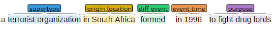
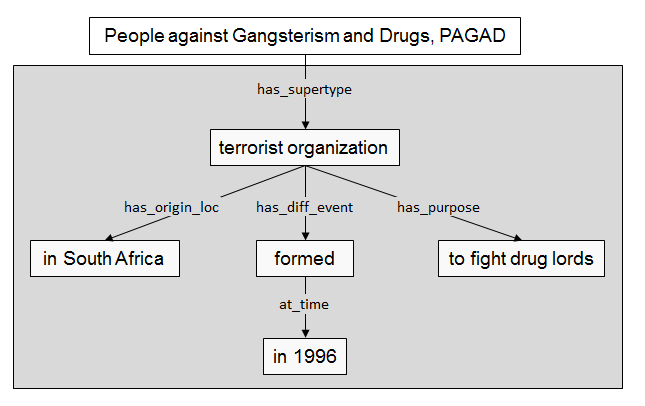

# WordNetGraph

The WordNetGraph is an RDF graph generated from WordNet, whose noun and verb definitions were labeled with Definition 
Semantic Roles (DSR). The definitions are classified using the DSR labels proposed in the following work:

> Vivian S. Silva, Siegfried Handschuh and André Freitas. Categorization of Semantic Roles for Dictionary Definitions. Cognitive Aspects of the Lexicon (CogALex-V), Workshop at the 26th International Conference on Computational Linguistics, (COLING), Osaka, 2016.

The classified definitions are segmented into roles. The RDF graph is a slightly modified version of the conceptual model presented in the paper. In this graph, each synset (definiendum) is a node, linked to its supertype. The supertype is, in turn, linked to all the other roles.

Please note that the role labeling is an automatic task, so the graph may contain some classification errors. The current accuracy of the automatic classifier is around 80%.

There are four namespaces defined for the model:

| Namespace | Full Namespace URI                                | Usage                                   |
|-----------|---------------------------------------------------|-----------------------------------------|
|dsr        |http://nlp/resources/DefinitionSemanticRoles#      | Model properties                        |
|wnn        |http://nlp/resources/synsets/WordNetNounSynset#    | Resources denoting WordNet noun synsets |
|wnv        |http://nlp/resources/synsets/WordNetVerbSynset#    | Resources denoting WordNet verb synsets |
|wne        |http://nlp/resources/expression/WordNetExpression# | Resources denoting the synset's definition roles, which can range from a single word to a whole sentence |

The following properties were defined for the model:

| Property            | Usage                                                | 
|---------------------|------------------------------------------------------|
|dsr:has_supertype    | Links the synset to the supertype(s) role(s)         |
|dsr:has\_diff_qual   | Links a supertype to a differentia quality role      |
|dsr:has\_diff_event  | Links a supertype to a differentia event role        |
|dsr:at_time          | Links a differentia event to its event time          |
|dsr:at_location      | Links a differentia event to its event location      |
|dsr:has\_qual_modif  | Links a differentia quality to its quality modifier  |
|dsr:has\_origin_loc  | Links a supertype to a origin location role          |
|dsr:has_purpose      | Links a supertype to a purpose role                  |
|dsr:has\_assoc_fact  | Links a supertype to a associated fact role          |
|dsr:has\_acc_qual    | Links a supertype to a accessory quality role        |
|dsr:has\_acc_det     | Links a supertype to a accessory determiner role     |

Supertype roles are always represented as resources. The differentia quality and differentia event roles can be represented as either resources, when they have components (event times and/or locations, or quality modifiers) to be linked to; or literals otherwise. All the other roles are represented as literals.

As an example, the noun synset `People against Gangsterism and Drugs, PAGAD`, whose definition is:

```
a terrorist organization in South Africa formed in 1996 to fight drug lords
```

received the following classification:



which can be interpreted as:



In the RDF graph, we have:

```xml
<rdf:Description rdf:about="http://nlp/resources/synsets/WordNetNounSynset#People_against_Gangsterism_and_Drugs__PAGAD">
    <rdf:type>
      <rdf:Statement>
        <rdf:object>to fight drug lords</rdf:object>
        <rdf:predicate rdf:resource="http://nlp/resources/DefinitionSemanticRoles#has_purpose"/>
        <rdf:subject rdf:resource="http://nlp/resources/expression/WordNetExpression#terrorist_organization"/>
      </rdf:Statement>
    </rdf:type>
    <rdf:type>
      <rdf:Statement>
        <rdf:object>
          <rdf:Statement>
            <rdf:object>in 1996</rdf:object>
            <rdf:predicate rdf:resource="http://nlp/resources/DefinitionSemanticRoles#at_time"/>
            <rdf:subject rdf:resource="http://nlp/resources/expression/WordNetExpression#formed"/>
          </rdf:Statement>
        </rdf:object>
        <rdf:predicate rdf:resource="http://nlp/resources/DefinitionSemanticRoles#has_diff_event"/>
        <rdf:subject rdf:resource="http://nlp/resources/expression/WordNetExpression#terrorist_organization"/>
      </rdf:Statement>
    </rdf:type>
    <rdf:type>
      <rdf:Statement>
        <rdf:object>in South Africa</rdf:object>
        <rdf:predicate rdf:resource="http://nlp/resources/DefinitionSemanticRoles#has_origin_loc"/>
        <rdf:subject rdf:resource="http://nlp/resources/expression/WordNetExpression#terrorist_organization"/>
      </rdf:Statement>
    </rdf:type>
    <dsr:has_supertype rdf:resource="http://nlp/resources/expression/WordNetExpression#terrorist_organization"/>
</rdf:Description>
```  
